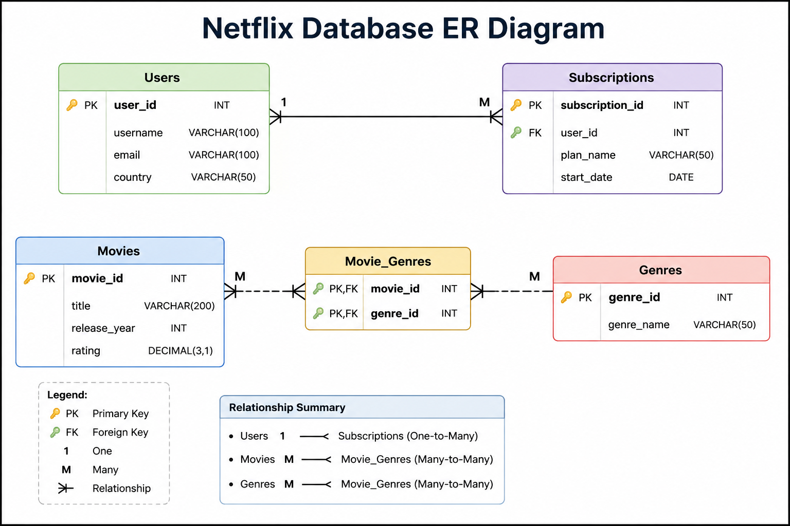

# Netflix-Database-Design-SQL
Netflix Database Design using SQL

# Netflix Database Design using SQL

## Project Overview

This project demonstrates the design and implementation of a Netflix-style relational database using SQL.

## Database Tables

- Users
- Movies
- Genres
- Movie_Genres
- Subscriptions

- - ## ER Diagram

## Features

- User Management
- Movie Catalog
- Genre Classification
- Subscription Tracking
- Many-to-Many Relationships

## SQL Concepts Used

- CREATE TABLE
- PRIMARY KEY
- FOREIGN KEY
- INSERT
- JOIN
- UPDATE
- SELECT

## Learning Outcomes

- Database Schema Design
- ER Modeling
- Relationship Design
- SQL Query Development

## Author

Arunkumar Karukolla
Data Analyst | SQL | Power BI | Python
